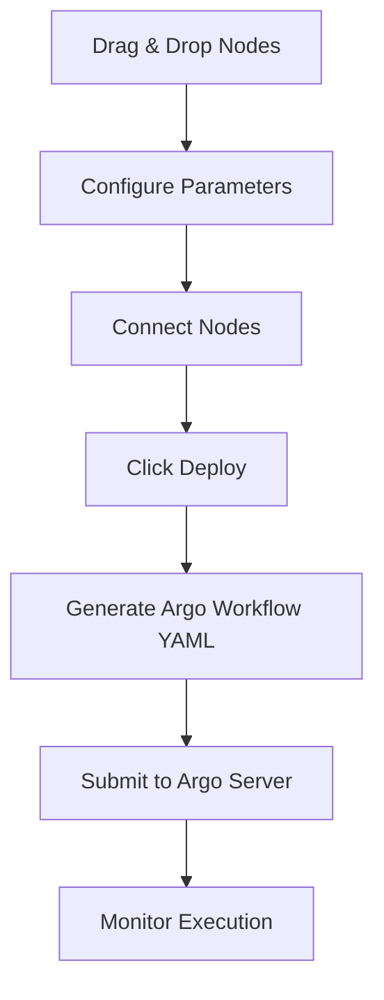

# ICMR FHIR No-Code Analytics Platform

A powerful no-code platform built with React Flow for creating and managing FHIR data analytics workflows.

## 🌟 Features

- **Visual Workflow Builder**: Drag-and-drop interface for creating analytics pipelines
- **Real-time Preview**: Instant visualization of analysis results
- **Argo Integration**: Automated workflow execution and scheduling
- **MinIO Storage**: Seamless data persistence and sharing
- **Component Library**: Pre-built nodes for common analytics operations
- **Custom Nodes**: Support for custom analytics components
- **Interactive Visualization**: Real-time plot customization

## 📋 Table of Contents

- [Prerequisites](#prerequisites)
- [Installation](#installation)
- [Kubernetes Setup](#kubernetes-setup)
- [Argo Workflow Setup](#argo-workflow-setup)
- [NGINX Configuration](#nginx-configuration)
- [Platform Configuration](#platform-configuration)
- [Usage Guide](#usage-guide)
- [Component Reference](#component-reference)

## 🔧 Prerequisites

- Node.js >= 14
- npm >= 6
- Docker
- Kubernetes (minikube)
- kubectl CLI
- Git

## 🚀 Installation

1. Clone the repository:
```bash
git clone https://github.com/your-org/icmr-fhir.git
cd icmr-fhir/scripts/FHIR-Visualizations/icmr_viz/icmr-react/icmr-analytics
```

2. Install dependencies:
```bash
npm install
```

## ⚙️ Kubernetes Setup

1. Install and start minikube:
```bash
# Install minikube (macOS)
brew install minikube

# Start minikube
minikube start

# Switch to minikube's Docker environment
eval $(minikube docker-env)
```

2. Verify setup:
```bash
kubectl get nodes
minikube status
```

## 🔄 Argo Workflow Setup

1. Create Argo namespace:
```bash
kubectl create namespace argo
```

2. Apply Argo configuration:
```bash
# Create a file named argo-config.yaml
cat > argo-config.yaml << 'EOL'
apiVersion: v1
kind: ServiceAccount
metadata:
  name: argo
  namespace: argo
---
apiVersion: rbac.authorization.k8s.io/v1
kind: ClusterRole
metadata:
  name: argo-cluster-role
rules:
  - apiGroups: [""]
    resources: ["pods", "pods/exec", "pods/log"]
    verbs: ["get", "list", "watch", "create", "update", "patch", "delete"]
---
apiVersion: rbac.authorization.k8s.io/v1
kind: ClusterRoleBinding
metadata:
  name: argo-binding
roleRef:
  apiGroup: rbac.authorization.k8s.io
  kind: ClusterRole
  name: argo-cluster-role
subjects:
  - kind: ServiceAccount
    name: argo
    namespace: argo
---
apiVersion: v1
kind: ConfigMap
metadata:
  name: workflow-controller-configmap
  namespace: argo
data:
  config: |
    containerRuntimeExecutor: pns
EOL

# Apply the configuration
kubectl apply -f argo-config.yaml
```

3. Deploy Argo Server:
```bash
kubectl apply -n argo -f https://raw.githubusercontent.com/argoproj/argo-workflows/stable/manifests/quick-start-postgres.yaml
```

## 🌐 NGINX Configuration

1. Create NGINX configuration:
```bash
# Create nginx.conf
cat > nginx.conf << 'EOL'
events {
    worker_connections 1024;
}

http {
    upstream argo_workflow {
        server argo-server:2746;
    }

    server {
        listen 80;
        server_name localhost;
        
        proxy_read_timeout 300;
        proxy_connect_timeout 300;
        proxy_send_timeout 300;

        location / {
            add_header Access-Control-Allow-Origin '*' always;
            add_header Access-Control-Allow-Credentials 'true';
            add_header Access-Control-Allow-Methods 'GET, POST, PUT, DELETE, PATCH, OPTIONS, HEAD' always;
            add_header Access-Control-Allow-Headers 'Authorization,Accept,Origin,DNT,X-CustomHeader,Keep-Alive,User-Agent,X-Requested-With,If-Modified-Since,Cache-Control,Content-Type,Content-Range,Range,token,BuildToken' always;
            if ($request_method = 'OPTIONS') {
                return 200;
            }
            proxy_pass http://argo_workflow;
            proxy_set_header Host $host;
            proxy_set_header X-Real-IP $remote_addr;
            proxy_set_header X-Forwarded-For $proxy_add_x_forwarded_for;
            proxy_set_header X-Forwarded-Proto $scheme;

            proxy_http_version 1.1;
            proxy_set_header Upgrade $http_upgrade;
            proxy_set_header Connection "upgrade";
        }
    }
}
EOL
```

2. Create Dockerfile for NGINX:
```bash
# Create Dockerfile
cat > Dockerfile << 'EOL'
FROM nginx:alpine
COPY nginx.conf /etc/nginx/nginx.conf
EXPOSE 80
CMD ["nginx", "-g", "daemon off;"]
EOL

# Build NGINX image
docker build . -t my-nginx:latest
```

3. Deploy NGINX:
```bash
# Create deployment configuration
cat > nginx-deployment.yaml << 'EOL'
apiVersion: v1
kind: Service
metadata:
  name: nginx-project
  namespace: argo
spec:
  type: ClusterIP 
  ports:
    - port: 80
  selector:
    app: nginx-project
---
apiVersion: apps/v1
kind: Deployment
metadata:
  name: nginx-project
  namespace: argo
spec:
  replicas: 1
  selector:
    matchLabels:
      app: nginx-project
  template:
    metadata:
      labels:
        app: nginx-project
    spec:
      containers:
        - name: nginx
          image: my-nginx:latest 
          ports:
            - containerPort: 80
          imagePullPolicy: Never
EOL

# Apply deployment
kubectl apply -f nginx-deployment.yaml
```

## 🔌 Platform Configuration

1. Get Argo authentication token:
```bash
# Get Argo token
ARGO_TOKEN=$(kubectl -n argo exec deploy/argo-server -- argo auth token)
echo $ARGO_TOKEN
```

2. Configure environment variables:
```bash
# Create .env file
cat > .env << EOL
REACT_APP_ARGO_API=http://localhost:3000
REACT_APP_ARGO_TOKEN=${ARGO_TOKEN}
REACT_APP_MINIO_ENDPOINT=your-minio-endpoint:9000
REACT_APP_MINIO_ACCESS_KEY=your-access-key
REACT_APP_MINIO_SECRET_KEY=your-secret-key
EOL
```

3. Start port forwarding:
```bash
# Forward NGINX port
kubectl port-forward -n argo svc/nginx-project 3000:80
```

4. Start the development server:
```bash
npm start
```

## 📦 MinIO Setup

1. Deploy MinIO on Kubernetes:
```bash
# Create MinIO namespace
kubectl create namespace minio-system

# Add MinIO Helm repository
helm repo add minio https://charts.min.io/
helm repo update

# Install MinIO
helm install minio minio/minio \
  --namespace minio-system \
  --set resources.requests.memory=1Gi \
  --set persistence.size=10Gi \
  --set mode=standalone
```

2. Get MinIO credentials:
```bash
# Get access key and secret key
echo "AccessKey: $(kubectl get secret minio -n minio-system -o jsonpath="{.data.accesskey}" | base64 --decode)"
echo "SecretKey: $(kubectl get secret minio -n minio-system -o jsonpath="{.data.secretkey}" | base64 --decode)"
```

3. Port forward MinIO:
```bash
# Forward MinIO API port
kubectl port-forward -n minio-system svc/minio 9000:9000 &

# Forward MinIO Console port
kubectl port-forward -n minio-system svc/minio 9001:9001 &
```

4. Access MinIO:
- API Endpoint: http://localhost:9000
- Console: http://localhost:9001
- Default bucket: icmr-fhir-data

## 🧩 Available Workflow Nodes

### 1. Data Source Nodes
- **FHIR Server Node**
  - Properties:
    - Server URL
    - Dataset Name
    - Resource Types
  - Output: Processed CSV files

- **CSV Import Node**
  - Properties:
    - File Selection
    - Column Mapping
    - Data Types
  - Output: Standardized DataFrame

- **MinIO Data Node**
  - Properties:
    - Bucket Name
    - File Path
    - File Type
  - Output: Retrieved Dataset

### 2. Transformation Nodes
- **Data Join Node**
  - Properties:
    - Join Type (inner, outer, left, right)
    - Join Columns
    - Output Naming
  - Output: Combined Dataset

- **Filter Node**
  - Properties:
    - Column Selection
    - Filter Conditions
    - Logical Operators
  - Output: Filtered Dataset

- **Aggregation Node**
  - Properties:
    - Group By Columns
    - Aggregation Functions
    - Output Format
  - Output: Aggregated Results

### 3. Analytics Nodes
- **Statistical Analysis Node**
  - Properties:
    - Operation Type (mean, median, mode, etc.)
    - Target Columns
    - Grouping Options
  - Output: Statistical Results

- **Clustering Node**
  - Properties:
    - Algorithm (K-means, Hierarchical)
    - Features
    - Cluster Count
  - Output: Cluster Assignments

- **Correlation Node**
  - Properties:
    - Variable Selection
    - Correlation Method
    - Significance Level
  - Output: Correlation Matrix

### 4. Visualization Nodes
- **Plot Node**
  - Properties:
    - Plot Type
    - Data Mapping
    - Visual Properties
  - Output: Interactive Plot

- **Dashboard Node**
  - Properties:
    - Layout Configuration
    - Plot Selection
    - Interactivity Settings
  - Output: Combined Visualization

## 🔄 Complete Workflow Process

### 1. Building a Workflow

1. **Node Selection and Placement**
```javascript
// Example node configuration
{
  id: 'fhir-source',
  type: 'dataSource',
  data: {
    serverUrl: 'http://fhir-server/fhir',
    dataset: 'covid_data'
  },
  position: { x: 100, y: 100 }
}
```

2. **Node Connection**
```javascript
// Example edge configuration
{
  id: 'edge-1',
  source: 'fhir-source',
  target: 'analysis-node',
  type: 'default'
}
```

### 2. Workflow Deployment Process

1. **Frontend to Backend Flow**:


2. **Argo Workflow Backend**:
```yaml
# Generated Argo Workflow
apiVersion: argoproj.io/v1alpha1
kind: Workflow
metadata:
  generateName: icmr-analysis-
spec:
  entrypoint: data-pipeline
  templates:
    - name: data-pipeline
      dag:
        tasks:
          - name: fetch-data
            template: fhir-download
          - name: analyze
            template: statistical-analysis
            dependencies: [fetch-data]
          - name: visualize
            template: create-plots
            dependencies: [analyze]
```

3. **Data Flow and Storage**:


### 3. MinIO Integration and Results

1. **Data Organization in MinIO**:
```
icmr-fhir-data/
├── raw/
│   └── fhir_download_20240315/
│       ├── patients.csv
│       └── observations.csv
├── processed/
│   └── analysis_20240315/
│       ├── statistical_results.json
│       └── correlation_matrix.csv
└── visualizations/
    └── plots_20240315/
        ├── correlation_heatmap.html
        └── cluster_scatter.png
```

2. **Accessing Results**:
```bash
# List buckets and contents
mc ls minio/icmr-fhir-data/

# Get specific results
mc cp minio/icmr-fhir-data/processed/analysis_20240315/statistical_results.json ./
```

### 4. Backend Operations

1. **Container Execution**:
- Each node runs in isolated container
- Containers share mounted MinIO volume
- Results automatically uploaded to MinIO

2. **Data Processing Flow**:
```python
# Example processing in container
def process_node(input_data, parameters):
    # 1. Read input from MinIO
    input_df = read_from_minio(input_data['path'])
    
    # 2. Perform operation
    result = perform_analysis(input_df, parameters)
    
    # 3. Save to MinIO
    save_to_minio(result, generate_output_path())
    
    # 4. Return metadata
    return {
        'status': 'completed',
        'output_path': output_path,
        'metrics': calculate_metrics(result)
    }
```

3. **Error Handling**:
- Automatic retries for failed nodes
- Error propagation to UI
- Result validation before storage

4. **Resource Management**:
- Dynamic resource allocation
- Parallel execution where possible
- Cleanup of temporary files

### 5. Example End-to-End Workflow

1. **Create Analysis Pipeline**:
```bash
# 1. Drag FHIR Source Node
# 2. Add Statistical Analysis Node
# 3. Connect Visualization Node
# 4. Configure Parameters:
{
  "source": {
    "dataset": "covid_data",
    "resources": ["Patient", "Observation"]
  },
  "analysis": {
    "type": "correlation",
    "variables": ["age", "temperature", "blood_pressure"]
  },
  "visualization": {
    "type": "heatmap",
    "title": "COVID-19 Variable Correlations"
  }
}
```

2. **Deploy and Monitor**:
```bash
# Watch workflow execution
kubectl get workflows -n argo -w

# Check pod logs
kubectl logs -n argo -l workflows.argoproj.io/workflow=icmr-analysis-xyz
```

3. **Access Results**:
```bash
# Get visualization URL
PLOT_URL=$(mc share download minio/icmr-fhir-data/visualizations/plots_latest/correlation_heatmap.html)
echo "View plot at: $PLOT_URL"
```

## 📚 Additional Resources

- [React Flow Documentation](https://reactflow.dev/)
- [Argo Workflows Documentation](https://argoproj.github.io/argo-workflows/)
- [MinIO Documentation](https://min.io/docs/minio/kubernetes/upstream/)
- [ICMR FHIR SDK Documentation](../README.md)

## 📄 License

This project is licensed under the MIT License - see the [LICENSE](LICENSE) file for details. 